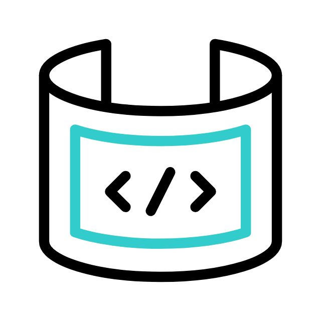

.png)

#  Socials:
  

#  Tech Stack:
     
#  GitHub Stats:
 
 

---

#  Blogs Posts
<!-- BLOG-POST-LIST:START -->
- [The &#39;SELECT&#39; Few: Enhancing SSMS with SQL Add-Ons and tweaks](https://dev.to/dotnet_emmanuel/the-select-few-enhancing-ssms-with-sql-add-ons-and-tweaks-n4k)
- [13 years, and welcome to The Nerd Heap!](https://dev.to/dotnet_emmanuel/13-years-and-welcome-to-the-nerd-heap-1b1l)
<!-- BLOG-POST-LIST:END -->
