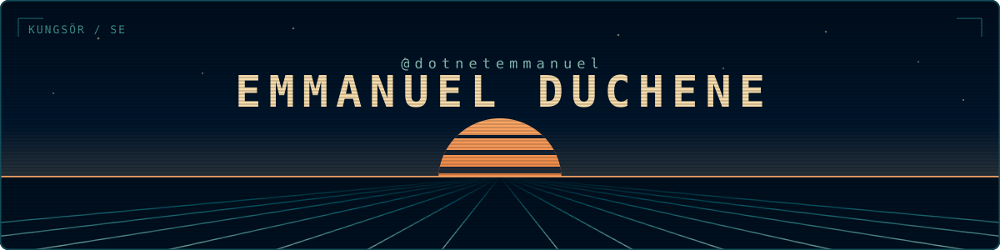
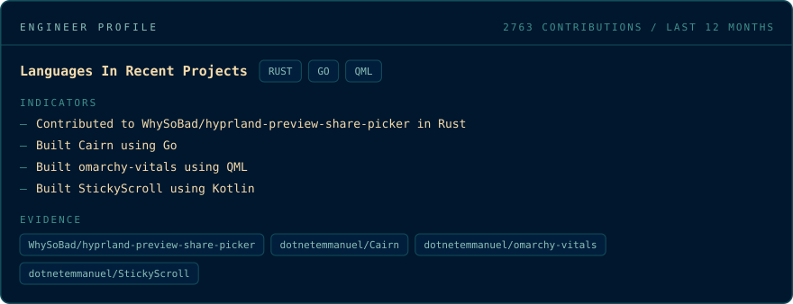
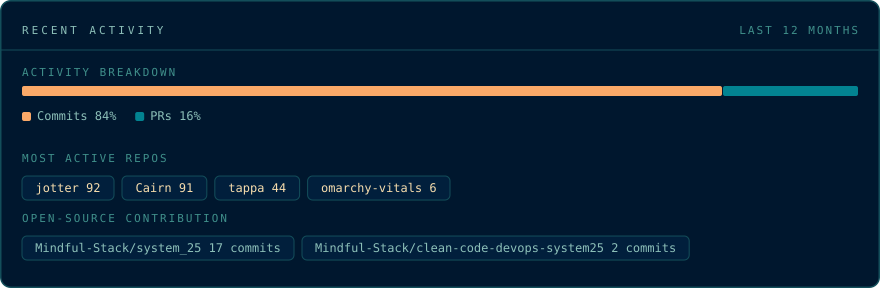
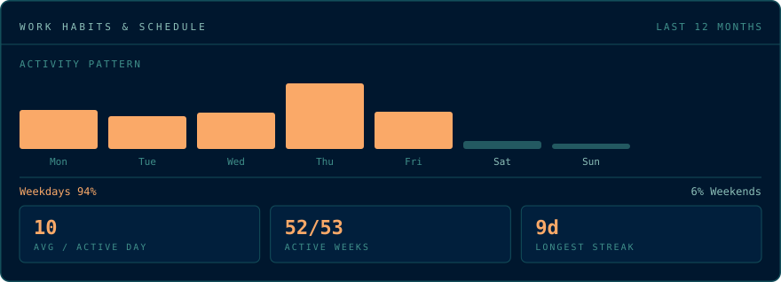

 

---

## `~/ whoami`

Systems developer at **[Mindful Stack](https://mindfulstack.se)**, building line-of-business
software and internal tooling on .NET.

###### The job

- 🏢 Systems developer at **[Mindful Stack](https://mindfulstack.se)**, where I build and maintain line-of-business systems
- 🧑‍🏫 Teaching on the *Systemutvecklare .NET* programme at **[Campus Nyköping](https://www.campusnykoping.se)**, part of the same role
- 📐 **Clean Code and Testable Architecture**: TDD and BDD, unit and integration testing, coupling and cohesion, design principles and patterns, and how architecture decides whether code is testable at all
- ⚙️ **Development Tools and DevOps**: continuous integration and deployment, test automation, build pipelines, branching strategy in git, and target environment configuration
- 🤝 Supervising LIA students through their placements

###### On my own time

- 🔭 **[Cairn](https://github.com/dotnetemmanuel/Cairn)**, a keyboard-driven TUI for stacked-PR workflows
- 📓 **[jotter](https://github.com/dotnetemmanuel/jotter)**, a small note-taking tool in Rust
- 🧩 **[StickyScroll](https://github.com/dotnetemmanuel/StickyScroll)**, a JetBrains IDE plugin
- ✍️ Writing at **[The Nerd Heap](https://dev.to/dotnet_emmanuel)**
- 🐧 Daily driver: Omarchy (Arch + Hyprland) on a ThinkPad P14s

---

## `~/ stack`

###### Languages

###### Frameworks & Runtimes

###### Data

###### Platform & Tooling

---

## `~/ projects`

| Project | What it is | Stack |
| :--- | :--- | :--- |
| **[Cairn](https://github.com/dotnetemmanuel/Cairn)** | A terminal cockpit for GitHub — PR board, review and stacked-PR workflow in one keyboard-driven TUI | `Go` `Bubble Tea` `GraphQL` |
| **[StickyScroll](https://github.com/dotnetemmanuel/StickyScroll)** | JetBrains IDE plugin adding a sticky folder header to the Project tool window | `Kotlin` `IntelliJ SDK` |
| **[jotter](https://github.com/dotnetemmanuel/jotter)** | A small, fast note-taking tool for the terminal | `Rust` |
| **[Chlorophy](https://github.com/dotnetemmanuel/Chlorophy)** | Plant management app with watering countdowns, built on the Perenual API | `C#` `.NET MAUI` |

More at **[github.com/dotnetemmanuel?tab=repositories](https://github.com/dotnetemmanuel?tab=repositories)**

---

## `~/ stats`

---

## `~/ writing` — The Nerd Heap

<!-- BLOG-POST-LIST:START -->
- [The &#39;SELECT&#39; Few: Enhancing SSMS with SQL Add-Ons and tweaks](https://dev.to/dotnet_emmanuel/the-select-few-enhancing-ssms-with-sql-add-ons-and-tweaks-n4k)
- [13 years, and welcome to The Nerd Heap!](https://dev.to/dotnet_emmanuel/13-years-and-welcome-to-the-nerd-heap-1b1l)
<!-- BLOG-POST-LIST:END -->

Auto-updated hourly from the dev.to feed via GitHub Actions.

---

Theme: <a href="https://github.com/OldJobobo/omarchy-retro-82-theme">Retro 82</a> for <a href="https://omarchy.org">Omarchy</a>

 

